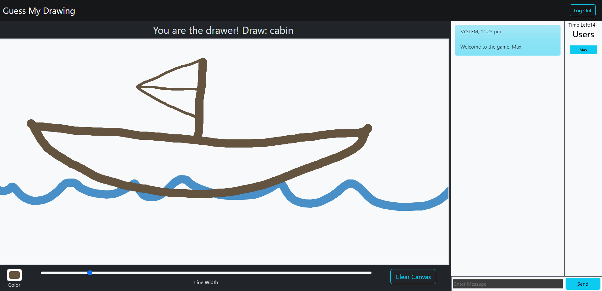

# Guess My Drawing

### *Like Pictionary? It’s like that, only you don’t need to wear pants.*

---

> [Deployed Application](https://guess-my-draw-47ce90c0ad48.herokuapp.com/login)
    
> [Repository](https://github.com/aidev13/guess-my-draw)

---

This is a simple game where one player tries to draw a picture, and the rest of the players try to guess what they’re drawing.  The drawing updates live for all players in real-time.  The first person to guess correctly wins the round!

---

## Technologies Used  
    "bcrypt":  "^5.0.0",
    "connect-session-sequelize":  "^7.0.4",
    "dayjs":  "^1.11.9",
    "dotenv":  "^8.2.0",
    "express":  "^4.17.1",
    "express-handlebars":  "^5.2.0",
    "express-session":  "^1.17.1",
    "mysql2":  "^2.2.5",
    "sequelize":  "^6.3.5",
    "socket.io":  "^4.7.2",
    "word-pictionary-list":  "^1.0.4"

